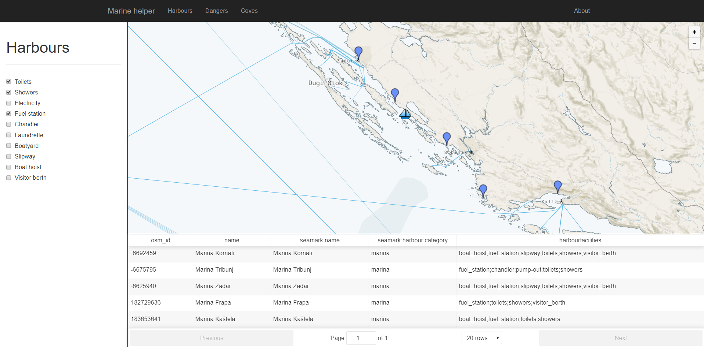

# Overview

This application is for recreational sailors to simplify the planning of safe sailing. Sailor has a choice of these scenarios:
- Harbours - show all harbours in area offering chosen services (showers, laundrette, fuel station...)
- Dangers - show chosen dangers (isolated dangers, rocks, coast lines) on selected cruise line
- Coves - show anchorages, moorings and underwater cables and pipes (you can't anchor above them) near sailors ship

These are some screenshots of application:




Application consists of [frontend side](#frontend) written in React using react-mapbox-gl wrapper for mapbox and [backend side](#backend) written in NodeJS providing [REST API](#api).

# Frontend

Frontend side is dynamic page written in React framework. Main menu allows user to choose between scenarios - harbours, dangers and coves. In scenario, it displays left panel with controls of data retrieval. Once the data are retrieved, they are both displayed on the bottom table and map in the middle.

## Map styling

Application is displaying sea marks, therefore the default map style is North Star, which is close to standard of charts (maritime maps). This style was also modified to show graticules (parallels and meridians), borders of the international and high seas, marine labels and highlight ferry roads as all of these might be usefull when on sea.

# Backend

Backend is written in NodeJS and serves for retrieving geographic data from postgres database.

## Data

Geographic data are downloaded from Open Street Maps. For this assignment, I downloaded most of the Croatian seas. This data was then imported to postgres using osm2pgsql. Standard configuration for import of these data wasn't enough, I had to add a few seamark columns and coast lines to configuration.

**Indices**

For faster queries, these indices on these columns were created:
- way - all tables
- natural - planet_osm_line, planet_osm_polygon
- seamark:type - all tables

**Queries**

Queries are written in controllers `pdt-marinehelper-server/api/controllers` or you can run a few queries yourself from [seamarks.sql](documentation-files/seamarks.sql).

**GIS functions**

Here is a list of all GIS functions used in queries:
- ST_Contains
- ST_Intersects
- ST_Intersection
- ST_Distance
- ST_DWithin

- ST_Transform
- ST_Buffer
- ST_AsGeoJSON
- ST_Centroid
- ST_GeomFromGeoJSON
- ST_SetSRID
- ST_MakePoint

## Api

**Harbours**

Get all harbours containing particular facilities:
`POST /harbours/getAllWithFacilities`

body example:
```
{
	"facilities": [
		"toilets", "fuel_station"
	],
  	"buffer": 100
}
```

Get harbour by osm_id:
`GET /harbours/getHarbour&id=244608718`

**Dangers**

Get all isolated dangers intersecting given line (buffered)
`POST /dangers/getIsolatedDangers`

Get all lateral signs intersecting given line (buffered)
`POST /dangers/getLateralSigns`

Get all cardinal signs intersecting given line (buffered)
`POST /dangers/getCardinalSigns`

Get all special purpose signs intersecting given line (buffered)
`POST /dangers/getSpecialPurposeSigns`

Get all lights intersecting given line (buffered)
`POST /dangers/getLights`

Get all rocks intersecting given line (buffered)
`POST /dangers/getRocks`

Get all wrecks intersecting given line (buffered)
`POST /dangers/getWrecks`

Get all coast lines intersecting given line (buffered)
`POST /dangers/getCoastLines`

body example for all queries
```
{
	"geojson": {
		"type": "LineString",
		"coordinates": [[13.9403774, 44.7759001004881], [16.4306572, 43.5313993005418]]
	},
	"buffer": 100
}
```

**Coves**

Get anchorages within given distance from given position
`GET /coves/getNearbyAnchorages?lat=43.2099645672&lng=16.3720972&maxDistance=30000`

Get moorings within given distance from given position
`GET /coves/getNearbyMoorings?lat=43.2099645672&lng=16.3720972&maxDistance=30000`

Get underwater cables and pipes within given distance from given position - can't anchor there
`GET /coves/getNearbyUnderwaterCablesAndPipes?lat=43.2099645672&lng=16.3720972&maxDistance=30000`

### Response

API calls return result array with table values and geojson which are then mapped into markers/geojsonlayers on frontend.

All APIs provided by server are exported into [insomnia](https://insomnia.rest/download/) file [apis-insomnia-export](documentation-files/apis-insomnia-export.json).
